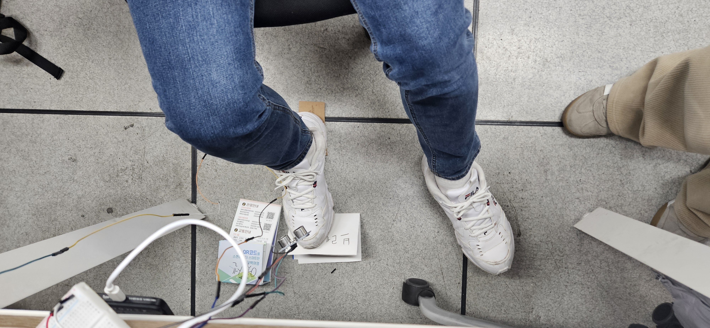
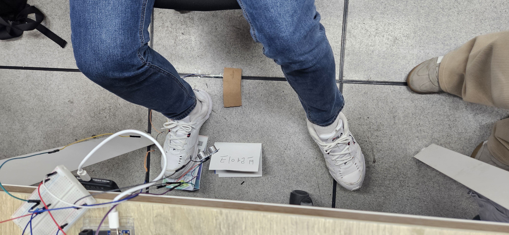

# Braker : oneM2M 기반 운전 자세 교정 시스템
---

# 서론
 본 프로젝트는 Arduino R4 WiFi와 압력 및 초음파 센서를 활용하여 운전자의 페달 조작 자세를 실시간으로 모니터링하고, 비정상적인 자세 감지 시 즉각적인 피드백을 제공하는 능동형 IoT 안전 운전 보조 시스템을 제안한다. 수집된 데이터는 oneM2M 표준 플랫폼을 통해 통합 관리되며, 이를 통해 사용자는 자신의 운전 습관을 객관적으로 파악하고 교정할 수 있는 환경을 제공받는다.

# 배경 
### 1. 페달 오인 사고의 정의

**페달 오인 사고**(Pedal Misapplication)는 운전자가 가속 페달(액셀)과 제동 페달(브레이크)을 혼동하여 잘못 조작함으로써 발생하는 사고를 말함
- **주요 특징**: 주로 주차장이나 저속 주행 상황에서 브레이크를 밟으려다 실수로 액셀을 강하게 밟아 발생합니다. 최근에는 고령 운전자의 인지 반응 속도 저하와 연관된 사고가 주목받고 있음
- **구분**: 급발진(차량 결함) 주장 사고 중 상당수가 조사 결과 '페달 오조작'으로 판명되는 경우가 많음

### 2. 관련 기술 현황 및 한계점 
- **페달 오조작 방지 장치(PMPD)**
   - 전후방 1~1.5m 범위에 장애물이 감지될 경우, 운전자가 실수로 급가속 페달을 밟으면 차량의 출력을 제한
   - **한계**: 장애물이 없는 개활지나 일반 도로 주행 중 발생하는 오조작에는 대응하기 어렵고, 정차 중 발진 시 상황에 특화되어 있음
 
- **페달 블랙박스** 
   - 운전석 하단에 카메라를 설치하여 페달 조작 과정을 영상으로 기록
   - **한계**: 사고 발생 후 원인을 규명하는 '사후 증거'로서의 가치는 높으나, 사고 자체를 실시간으로 예방하는 기능은 수행할 수 없음
- **스마트카 안전 지원 시스템**  
   - 일본은 '서포카(Safety Support Car)' 제도를 통해 고령 운전자 차량에 오조작 방지 기능을 탑재하도록 유도하고 있음
   - **한계**: 하드웨어적인 제어에 집중

### 3. 원인 규명
일본 교통사고종합분석센터(ITARDA)의 연구 데이터(Report No. 124)를 참조함
> - [ITARDA Information No.124 원문 보기](https://www.itarda.or.jp/contents/92/info124_e.pdf)

해당 리포트에 따르면 페달 오조작은 단순한 주의력 결핍이 아닌, 신체 노화에 따른 **물리적 자세 붕괴**에서 기인
- 신체적 요인 (Physical Factor): 고령 운전자는 고관절의 유연성 및 내회전 가동 범위가 축적됨에 따라 양 허벅지가 벌어지는 자세를 취하게 됨. 이로 인해 오른발의 각도가 가속 페달 쪽으로 기울어지며, 브레이크 조작 시 페달의 우측 단면을 밟거나 가속 페달을 오조작할 확률이 비약적으로 상승. 즉, **물리적으로 뒤틀린 자세**가 사고의 핵심 변수로 작용함.

- 상황적 요인 (Situational Factor): 페달 오인 사고는 교차로 주행보다 주차장 내 출발(Starting up) 및 위치 수정 상황에서 빈번히 발생함. 이는 **좁은 공간에서의 잦은 페달 전환 과정**에서 신체적 부조화가 극대화됨을 시사함.

- 심리적 요인 (Psychological Factor): 조작 오류 발생 시 운전자가 느끼는 **당황(Panic)** 상태는 이성적인 판단을 저해하며, 본능적인 회피 동작이 오히려 가속 페달을 더 강하게 밟는 결과로 이어져 사고의 규모를 키우는 주요 원인이 됨.

### 4. 연구의 당위성 및 제안 시스템의 필요성
이러한 분석 결과는 사고 예방을 위해 차량의 출력을 제어하는 하드웨어적 접근뿐만 아니라, 운전자의 착좌 자세를 실시간으로 모니터링하고 교정하는 소프트웨어적 접근이 필수적임을 보여줌.

따라서 본 프로젝트는 실시간 자세 피드백을 통해 고령 운전자의 신체적 한계로 인한 오조작 메커니즘을 사전에 차단하는 것을 목표로 한다.

## 핵심 기능 및 시스템 아키텍
1. **정밀 하체 자세 모니터링** (무릎 거리 센서)
- **기능**: 초음파 센서를 활용해 운전자의 무릎과 대시보드 간의 실시간 거리 측정.
- **효과**: 급브레이크 시 무릎 각도가 부적절하여 발생하는 페달 오 조작을 방지하고, 인체공학적 최적 위치를 벗어날 경우 즉각적인 피드백 제공.

2. **페달 오인 방지 시스템** (압력 센서)
- **기능**: 페달 주변 발판 및 페달의 압력 분포를 감지하여 뒤꿈치의 위치(축)를 확인.
- **효과**: 가속 페달과 브레이크 페달 사이의 올바른 뒤꿈치 고정 위치를 유도하여, 당황한 상태에서 페달을 혼동하는 '페달 오인 사고'의 근본적 원인 차단.

3. **oneM2M 기반 데이터 통합 및 관제**
- **기능**: Arduino R4 WiFi를 통해 수집된 센서 데이터를 oneM2M 표준 규격으로 캡슐화하여 플랫폼 전송.
- **효과**: 데이터의 상호운용성을 확보하고, 웹 대시보드를 통해 실시간 운전 자세 모니터링 및 장기적인 운전 습관 데이터 분석 가능.

## 기술 스택 
1. **Hardware & Sensing**
- Main Controller: **Arduino Uno R4 Wi-Fi**
   - 32-bit ARM Cortex-M4 프로세서 기반의 강력한 연산 능력 활용.
   - 내장 Wi-Fi 모듈을 통해 추가 실드 없이 oneM2M 플랫폼과의 직접적인 HTTP 통신 구현.
- Sensors:
   - 초음파 센서 (HC-SR04): 운전자의 무릎과 대시보드 간의 실시간 거리 측정 및 최적 운전 자세 이탈 감지.
   - 압력 센서 (FSR): 뒤꿈치의 지지점 및 페달 인근 압력 분포를 감지하여 '페달 오인' 가능성 실시간 모니터링.

2. **IoT Platform & Backend**
- Platform: oneM2M (Mobius/Ocean)
   - 국제 표준 IoT 플랫폼을 활용한 데이터의 상호운용성 확보.
   - Resource Tree 구조를 설계하여 센서 데이터(Container)와 제어 신호(Content Instance)를 체계적으로 관리.
- Communication: HTTP/REST API
   - Arduino와 서버 간의 비동기 통신을 통한 데이터 전송.
   - 표준 규격에 따른 POST, GET 요청으로 데이터 무결성 유지.

3. **Frontend & Visualization**
- Framework: Vue.js
   - 컴포넌트 기반 설계를 통해 운전 데이터의 실시간 반응형 UI 구현.
   - Axios 라이브러리를 활용해 Mobius 서버로부터 최신 센서 데이터를 Fetch하여 시각화.

## 테스트 진행 

상황 1 : 올바른 자세 유지 시

  

상황 2 : 잘못된 뒷꿈치 위치 유지 시

  

상황 3 : 잘못된 무릎 위치 유지 시

  

